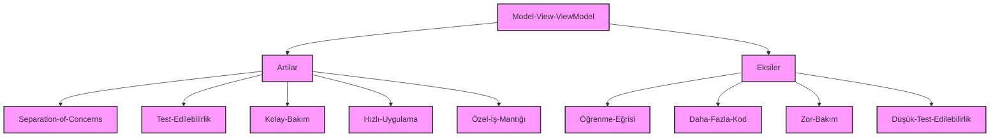

# MVVM Modeli ile Geleneksel WPF Uygulaması Arasındaki Farklar
## Soru 1: Şöyle geliştirilmiş bir uygulama ile MVVM modelindeki hali arasındaki farklar ne olur? Artılar ve eksiler nelerdir?

### Geleneksel WPF Uygulaması

```csharp
using Microsoft.Win32;
using System;
using System.Collections.Generic;
using System.Data;
using System.IO;
using System.Linq;
using System.Text;
using System.Threading.Tasks;
using System.Windows;
using System.Windows.Controls;
using System.Windows.Data;
using System.Windows.Documents;
using System.Windows.Input;
using System.Windows.Media;
using System.Windows.Media.Imaging;
using System.Windows.Media.TextFormatting;
using System.Windows.Navigation;
using System.Windows.Shapes;
using System.Xml;

namespace WpfApp2
{
    /// <summary>
    /// Interaction logic for MainWindow.xaml
    /// </summary>
    public partial class MainWindow : Window
    {
        bool IsContextMenuOpen = false;
        bool IsFolderOpen = false;
        DataTable dataTable = new DataTable();
        DataGrid silmeGrid = new DataGrid();
        DataGrid guncelleGrid = new DataGrid();
        DataGrid xmlGrid = new DataGrid();

        public int guncelleIndex;

        public static string _adimNo;
        public static string _hiz;
        public static string _x;
        public static string _xMid;
        public static string _y;
        public static string _yMid;
        public static string _toolNo;
        public static string _gosTool;
        public MainWindow()
        {
            InitializeComponent();

            Init();
        }

        private void Init()
        {
            DatatableKolonEkle();
        }

        private void DatatableKolonEkle()
        {
            dataTable.Columns.Add(new DataColumn("ADIMNO", typeof(string)));
            dataTable.Columns.Add(new DataColumn("HIZ", typeof(string)));
            dataTable.Columns.Add(new DataColumn("X", typeof(string)));
            dataTable.Columns.Add(new DataColumn("XMID", typeof(string)));
            dataTable.Columns.Add(new DataColumn("Y", typeof(string)));
            dataTable.Columns.Add(new DataColumn("YMID", typeof(string)));
            dataTable.Columns.Add(new DataColumn("TOOLNO", typeof(string)));
            dataTable.Columns.Add(new DataColumn("GOSTOOL", typeof(string)));
        }

        private void mainDataGrid_PreviewMouseUp(object sender, MouseButtonEventArgs e)
        {
            DataGrid eee = sender as DataGrid;
            guncelleIndex = eee.SelectedIndex;
            silmeGrid = eee;
            if (IsContextMenuOpen || IsFolderOpen || eee.Items.Count <= 0)
            {
                return;
            }
        }

        private void mainDataGrid_PreviewMouseRightButtonUp(object sender, MouseButtonEventArgs e)
        {
            DataGrid eee = sender as DataGrid;
            guncelleIndex = eee.SelectedIndex;
            silmeGrid = eee;
            xmlGrid = eee;
            guncelleGrid = eee;
            IsContextMenuOpen = true;
            ContextMenu cm = new ContextMenu();
            MenuItem menuItem0 = new MenuItem();
            menuItem0.Header = "Yeni Ekle";
            menuItem0.PreviewMouseDown += MenuItem0_PreviewMouseDown;
            cm.Items.Add(menuItem0);
            MenuItem menuItem1 = new MenuItem();
            menuItem1.Header = "Sil";
            menuItem1.PreviewMouseDown += MenuItem1_PreviewMouseDown;
            cm.Items.Add(menuItem1);
            MenuItem menuItem2 = new MenuItem();
            menuItem2.Header = "Güncelle";
            menuItem2.PreviewMouseDown += MenuItem2_PreviewMouseDown; 
            cm.Items.Add(menuItem2);
            cm.Closed += Cm_Closed;
            mainDataGrid.ContextMenu = cm;
        }

        private void MenuItem2_PreviewMouseDown(object sender, MouseButtonEventArgs e)
        {
            Update_Method();
        }

        private void Update_Method()
        {
            if (mainDataGrid.Items.Count > 0)
            {
                DataGrid eee = guncelleGrid;
                guncelleIndex = eee.SelectedIndex;
                DataRowView a = eee.Items[mainDataGrid.SelectedIndex] as DataRowView;

                YeniEkleWindow.mainWindow = this;
                YeniEkleWindow.updateGrid = eee;
                YeniEkleWindow.updateRow = a;
                YeniEkleWindow.IsUpdate = true;
                YeniEkleWindow yeniEkleWindow = new YeniEkleWindow();
                yeniEkleWindow.ShowDialog();
                YeniEkleWindow.IsUpdate = false;
            }
        }

        private void MenuItem1_PreviewMouseDown(object sender, MouseButtonEventArgs e)
        {
            Sil_Method();
        }

        private void Sil_Method()
        {
            if (mainDataGrid.Items.Count > 0)
            {
                if (mainDataGrid.SelectedItems.Count > 1)
                {
                    DataGrid eee = silmeGrid;

                    int selectedItemsCount = mainDataGrid.SelectedItems.Count;
                    for (int j = 0; j < selectedItemsCount; j++)
                    {
                        DataRowView a = eee.Items[mainDataGrid.SelectedIndex] as DataRowView;
                        a.Row.Delete();
                    }


                    int i = 0;
                    foreach (DataRowView item in mainDataGrid.Items)
                    {
                        item["ADIMNO"] = i + 1;
                        i++;
                    }
                }
                else
                {
                    DataGrid eee = silmeGrid;
                    DataRowView a = eee.Items[mainDataGrid.SelectedIndex] as DataRowView;

                    a.Row.Delete();

                    int i = 0;
                    foreach (DataRowView item in mainDataGrid.Items)
                    {
                        item["ADIMNO"] = i + 1;
                        i++;
                    }
                }
            }
        }

        private void Cm_Closed(object sender, RoutedEventArgs e)
        {
            IsContextMenuOpen = false;
        }

        private void MenuItem0_PreviewMouseDown(object sender, MouseButtonEventArgs e)
        {
            YeniEkleWindow.mainWindow = this;
            YeniEkleWindow.adimNo = mainDataGrid.Items.Count + 1;
            YeniEkleWindow yeniEkleWindow = new YeniEkleWindow();
            yeniEkleWindow.ShowDialog();
        }

        public void Method(string adimNo, string hiz, string x, string xMid, string y, string yMid, string toolNo, string gosTool)
        {
            _adimNo = adimNo;
            _hiz = hiz;
            _x = x;
            _xMid = xMid;
            _y = y;
            _yMid = yMid;
            _toolNo = toolNo;
            _gosTool = gosTool;
        }

        public void Method2()
        {
            if (!YeniEkleWindow.IsUpdate)
            {
                DataRow dtRow = dataTable.NewRow();
                dtRow["ADIMNO"] = _adimNo;
                dtRow["HIZ"] = _hiz;
                dtRow["X"] = _x;
                dtRow["XMID"] = _xMid;
                dtRow["Y"] = _y;
                dtRow["YMID"] = _yMid;
                dtRow["TOOLNO"] = _toolNo;
                dtRow["GOSTOOL"] = _gosTool;

                dataTable.Rows.Add(dtRow);
            }
            else
            {
                DataRow dtRow = dataTable.NewRow();
                dtRow["ADIMNO"] = _adimNo;
                dtRow["HIZ"] = _hiz;
                dtRow["X"] = _x;
                dtRow["XMID"] = _xMid;
                dtRow["Y"] = _y;
                dtRow["YMID"] = _yMid;
                dtRow["TOOLNO"] = _toolNo;
                dtRow["GOSTOOL"] = _gosTool;

                dataTable.Rows.RemoveAt(guncelleIndex);
                dataTable.Rows.InsertAt(dtRow,guncelleIndex);
            }
            mainDataGrid.ItemsSource = dataTable.AsDataView();
        }

        private void btnOpenXml_Click(object sender, RoutedEventArgs e)
        {
            IsFolderOpen = true;
            OpenFileDialog ofd = new OpenFileDialog();
            ofd.DefaultExt = "XML File|*.xml";
            ofd.Multiselect = false;
            ofd.InitialDirectory = AppDomain.CurrentDomain.BaseDirectory;
            ofd.Title = "Open XML File";

            Nullable<bool> result = ofd.ShowDialog();
            if (result == true)
            {
                DataSet xmlRead = new DataSet();
                xmlRead.ReadXml(AppDomain.CurrentDomain.BaseDirectory + "\\XmlSave\\" + ofd.SafeFileName, XmlReadMode.ReadSchema);

                mainDataGrid.ItemsSource = null;
                dataTable = xmlRead.Tables[0];
                mainDataGrid.ItemsSource = xmlRead.Tables[0].AsDataView();
            }
            IsFolderOpen = false;
        }

        private void btnSaveXml_Click(object sender, RoutedEventArgs e)
        {
            SaveFileDialog sfd = new SaveFileDialog();
            sfd.Filter = "XML File|*.xml";
            sfd.Title = "Save an XML File";
            sfd.InitialDirectory = AppDomain.CurrentDomain.BaseDirectory;
            Nullable<bool> result = sfd.ShowDialog();
            if (result == true)
            {
                DataSet dataSet = new DataSet();
                dataSet.Tables.Add(dataTable);
                dataSet.WriteXml(AppDomain.CurrentDomain.BaseDirectory + "\\XmlSave\\" + sfd.SafeFileName, XmlWriteMode.WriteSchema);
            }
        }
    }
}
```

# MVVM Modeli ile Geleneksel WPF Uygulaması Arasındaki Farklar

## Geleneksel WPF Uygulaması

### Artılar

- **Hızlı Başlangıç**: Daha hızlı bir başlangıç sağlar çünkü UI ve iş mantığı tek bir sınıfta yer alır.
- **Daha Az Abstraksiyon**: Daha az soyutlama ve ekstra sınıf oluşturma gerektirir.

### Eksiler

- **Kod Karmaşıklığı**: İş mantığı ve UI kodlarının aynı dosyada bulunması, kodun karmaşıklaşmasına ve bakımının zorlaşmasına neden olabilir.
- **Test Edilebilirlik**: İş mantığı ve UI'nin aynı sınıfta olması, birim testleri yazmayı ve yönetmeyi zorlaştırır.
- **Zorluklar**: UI değişiklikleri yaparken iş mantığını etkileme riski vardır.

## MVVM Modeli

### Artılar

- **Temiz Ayrım**: UI ve iş mantığı arasındaki net ayrım, kodun daha temiz ve yönetilebilir olmasını sağlar.
- **Test Edilebilirlik**: İş mantığını (ViewModel) UI'dan (View) ayırarak, iş mantığının bağımsız olarak test edilmesini sağlar.
- **Veri Bağlama**: WPF’in veri bağlama özelliklerinden tam olarak faydalanarak, UI’nin veri değişikliklerini otomatik olarak yansıtmasını sağlar.
- **Yeniden Kullanılabilirlik**: ViewModel ve Model, farklı View'lar arasında yeniden kullanılabilir.

### Eksiler

- **Öğrenme Eğrisi**: MVVM modelinin öğrenilmesi ve uygulanması zaman alabilir, özellikle yeni başlayanlar için.
- **Kod Miktarının Artışı**: Daha fazla sınıf ve kod gerektirir. Küçük projelerde bu, fazla bir yük getirebilir.
- **Geçiş Zorluğu**: Mevcut büyük bir kod tabanını MVVM modeline dönüştürmek karmaşık olabilir.

### Sonuç

Geleneksel WPF uygulamaları, hızlı bir başlangıç sağlasa da, MVVM modelinin sağladığı temiz ayrım, test edilebilirlik ve veri bağlama avantajları, uzun vadede büyük projelerde daha etkili ve sürdürülebilir bir çözüm sunar. MVVM, özellikle büyük ve karmaşık projelerde, kodun düzenlenmesini ve bakımını kolaylaştırırken, daha küçük projelerde veya mevcut kod tabanlarına geçişte bazı zorluklar yaşanabilir.

# MVVM Modelinin Artıları ve Eksileri


